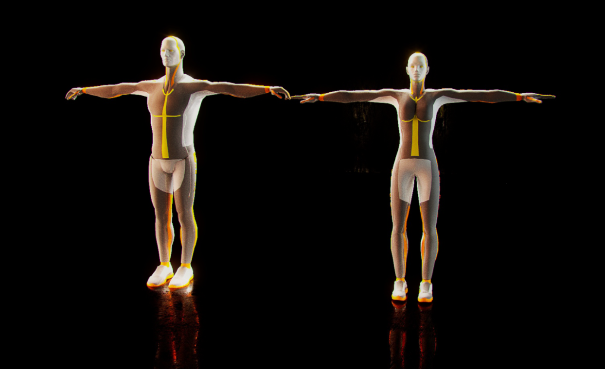

<div align="center">   

# ZEGGS

## ZeroEGGS: Zero-shot Example-based Gesture Generation from Speech

[](https://arxiv.org/abs/2209.07556)


</div>

This repository contains the code for the ZeroEGGS project from
this [article](https://arxiv.org/abs/2209.07556).
It also contains our stylized speech and gesture dataset

<div align="center">  

[](http://www.youtube.com/watch?v=YFg7QKWkjwQ "Click to watch the video demo")

[Click](http://www.youtube.com/watch?v=YFg7QKWkjwQ) to watch the video demo

</div>

## Environment Setup

Create and activate a virtual environment to work in, e.g. using Conda:

```sh
conda create -n zeggs python=3.8
conda activate zeggs
```

Install CUDA and PyTorch 1.12.x For CUDA 11.3, this would look like:

```sh
conda install pytorch torchvision cudatoolkit=11.3 -c pytorch
```

Install the remaining requirements with pip:

```sh
pip install -r requirements.txt
```

> You may need to install [`sox`](http://sox.sourceforge.net/) on your system

## ZEGGS Dataset

<div align="center"> 


</div>
ZEGGS dataset contains 67 sequences of monologues performed by a female actor speaking in English and covers 19 different motion styles. 

The following styles are present in the ZEGGS dataset:

<div align="center">  

| **Style** | **Length (mins)** | **Style** | **Length (mins)** |
|--------------|-----------------------|-------|---------------|
| Agreement    | 5.25                  | Pensive | 6.21          |
| Angry        | 7.95                  | Relaxed | 10.81         |
| Disagreement | 5.33                  | Sad   | 11.80         |
| Distracted   | 5.29                  | Sarcastic | 6.52          |
| Flirty       | 3.27                  | Scared | 5.58          |
| Happy        | 10.08                 | Sneaky | 6.27          |
| Laughing     | 3.85                  | Still | 5.33          |
| Oration      | 3.98                  | Threatening | 5.84          |
| Neutral      | 11.13                 | Tired | 7.13          |
| Old          | 11.37                 | Total | 134.65        |

</div>  
    
### Access to the data
> This repository contains large files. In order to clone this repository including
> the the large zip files, you need to use [git lfs](https://github.com/git-lfs/git-lfs/wiki/Installation).
> If you still get errors, directly download `zip` files.

The speech and gesture data are contained in the `./data/Zeggs_data.zip`, `./data/Zeggs_data.z01`, and `./data/Zeggs_data.z02` files. You must put all of these parts to the same folder, and extract `.zip` file by WinRAR or Winzip.

When you extract the zip file, there are two folders:

- `original` folder contains the original data where the animation and audio files are in their raw version and not
  processed.

- `clean` contains aligned animation and audio data and without unwanted audio of other speaker. For more details on how
  these files have been processed check `data_pipeline.py`

All the animation sequences are in the BVH file format and all the audio data are in WAV format. 

## Data Preparation

Extract the data from the `Zeggs_data.zip` file and place it in the `data` folder. Next run:

```sh
python data_pipeline.py
```

This processes data and creates the necessary files for training and evaluation in the "processed" folder. You can
customize the data pipeline by changing `data_pipeline_conf.json` config file. Two suggested configurations are provided
in the `configs` folder. You should change the configuration file name in the script.

## Training

You can use pre-trained models stored in `./data/outputs/saved_models`.
However, if you want to train the model from scratch, run:

```sh
python ./main.py -o <configs> -n <run_name>
```

For example, to train the model with the default configuration, run:

```sh
python ./main.py -o "../configs/configs_v1.json" -n "zeggs_v1"
```

## Inference

After training is finished or using provided pretrained models (provided in `./data/outputs`), you can generate gestures
given speech and style as
input
using `generate.py`. The output will be save in `bvh` format. For full functionality (blending, transitions, using
pre-extracted style encodings, etc. ) you need
to directly use `generate_gesture` function. Otherwise, you can use CLI as explained below.

### Using the CLI

You can run the inference using the CLI in two ways:

#### 1. Generating a single sample from a single audio/style pair

The CLI command looks like this:

```sh
python ./generate.py -o <options file> -s <style file> -a <audio file>
```

where `options file` is similar to the training config file but contains the path to the saved pretrained models and
other required data. For example, you can run:

```sh
python ./generate.py -o "../data/outputs/v1/options.json" -s "../data/clean/067_Speech_2_x_1_0.bvh" -a "../data/clean/067_Speech_2_x_1_0.wav"
```

To get more help on how to set other parameters such as seed, temperature, output file name, etc., run the command
below:

```sh
python ./generate.py -h.
```

#### 2. Generating a batch of samples from a CSV file

You can generate a batch of animated gestures from a csv file containing audio and style file paths along with other
parameters by running:

```sh
python ./generate.py -o <options file> -c <CSV file>
```

For example, you can run:

```sh
python ./generate.py -o "../data/outputs/v1/options_file.json" -c "../data/test/evaluation.csv"
```

## Rendering

The compatible FBX files (male and female characters) along with a MotionBuilder *bvh2fbx* script is provided in `./bvh2fbx` folder. You need to modify the path 
to your python environment and also the FBX character in `bvh2fbx.py` and the paths to the MotionBuilder plugins and executable in `bvh2fbx.bat` scripts. 
Put all the pairs of bvh and wav files (with the same name) in the `./bvh2fbx/Rendered` folder and run `bvh2fbx.bat` script. 

<div align="center"> 



</div>

## Citation

If you use this code and dataset, please cite our paper

```
@article{ghorbani2022zeroeggs,
  title={ZeroEGGS: Zero-shot Example-based Gesture Generation from Speech},
  author={Ghorbani, Saeed and Ferstl, Ylva and Holden, Daniel and Troje, Nikolaus F and Carbonneau, Marc-Andr{\'e}},
  journal={arXiv preprint arXiv:2209.07556},
  year={2022}
}
```   

© [2022] Ubisoft Entertainment. All Rights Reserved
